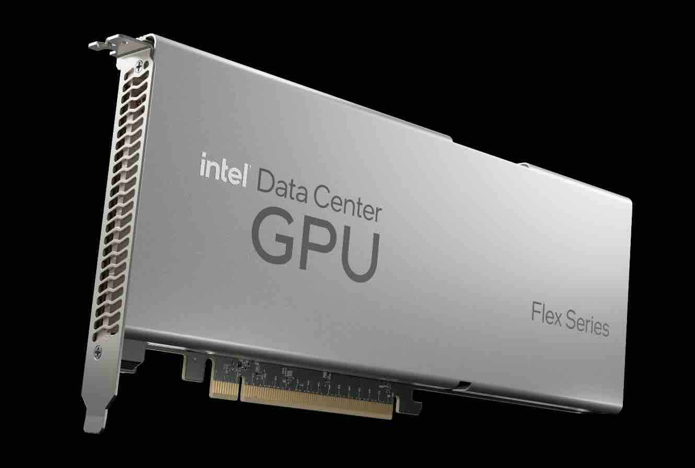
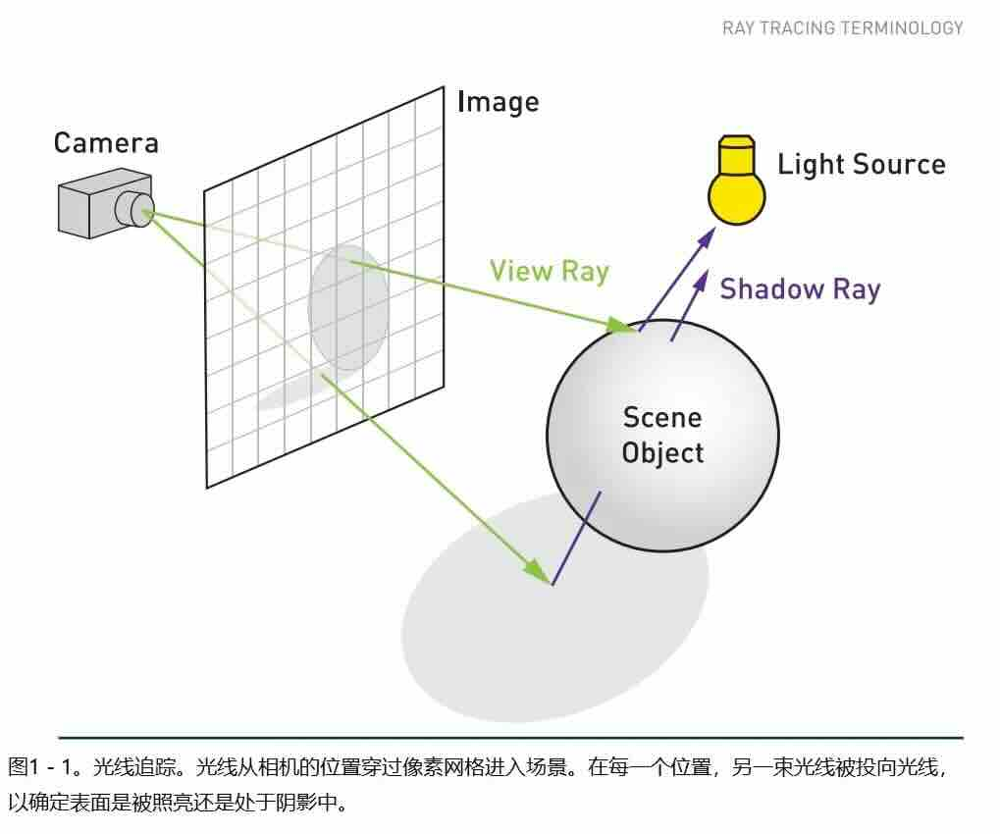

## 1.3 GPU
图形处理器（Graphics Processing Unit，简称GPU），是一种用于处理图像和图形运算工作的协处理器。
GPU被广泛应用在个人电脑、工作站和一些移动设备（如智能手机、平板电脑等）。在本教程中,我们将它简称为GPU。

### 1.3.1 GPU的作用

GPU最初被创造出来，就是为了解决一个极其繁重的并行计算任务：实时渲染3D图形。

在3D游戏或应用中，屏幕上的图像是由成千上万个三角形构成的。
为了生成一帧画面，需要为每个像素计算颜色、光照、阴影等。一个1080p的屏幕就有超过200万个像素。
如果仅仅利用CPU的计算能力，速度会极慢。

而GPU的并行架构完美地解决了这个问题。

- 顶点着色：同时处理所有三角形的顶点位置。
- 光栅化：将三角形转换为像素。
- 像素着色：同时为所有像素计算最终颜色。

这个过程天生就是高度并行的，因此GPU应运而生，专门为此优化。

### 1.3.2 GPU的新发展（GPGPU）

人们很快发现，GPU的这种强大并行能力不仅仅能用来画图。
任何需要对大量数据执行相同操作的任务，都可以从GPU中获益。这就是 “通用图形处理器” 的概念，简称 GPGPU。

借助NVIDIA的CUDA、开放的OpenCL等编程平台，开发者可以直接利用GPU进行通用目的计算。

主要应用领域包括：

- 人工智能与深度学习

这是当今GPU最重要的应用领域。神经网络的训练和推理本质上就是大规模的矩阵和张量运算，完美契合GPU的并行架构。
可以说，没有GPU，就没有现代深度学习的爆发。

- 科学计算与仿真

天气预测、流体动力学、分子动力学、天文物理等领域的模拟，需要处理海量数据和复杂公式，GPU能将这些计算从“数月”缩短到“数天”。

- 加密货币挖矿

挖矿过程需要重复进行大量的哈希计算，这正是GPU所擅长的。在挖矿热潮中，GPU一度成为硬通货。

>[!CAUTION]
> 本教程不鼓励读者进行任何形式的加密货币交易与投机活动！

- 视频处理与编码

当你用视频编辑软件添加特效、转场，或者用直播软件推流时，GPU可以极大地加速视频的编码和解码过程。

- 专业可视化

CAD/CAM设计、医学成像（如MRI重建）、好莱坞特效渲染等，都需要GPU提供强大的实时渲染和计算能力。

### 1.3.3 GPU的性能参数

了解GPU的性能参数是选择合适显卡的关键。这些参数共同决定了GPU在处理图形和进行计算任务时的速度和能力。

本教程从核心计算参数、内存系统参数、功能与特性参数、物理与功耗参数四大类进行详细解释。

#### 1.3.3.1 核心计算参数

这部分参数直接关系到GPU的“算力”。

- CUDA核心 / 流处理器 / Xe核心

这是GPU最基本的计算单元。NVIDIA称为CUDA核心，AMD称为流处理器，Intel称为Xe核心。数量越多，GPU的并行处理能力越强。

>[!CAUTION]
> 核心数量是性能的基础。在其他条件相同的情况下，核心数越多，性能通常越好。但不同架构的核心效率不同，不能直接跨代或跨品牌对比数量。

- 时钟频率

GPU核心工作的速度，单位通常是MHz或GHz。有基础频率和加速频率（Boost Clock）之分。加速频率是GPU在散热和功耗允许下能达到的最高工作频率。

频率越高，每个核心的计算速度越快。它和核心数量共同决定了理论峰值算力。

- 架构

GPU核心的设计蓝图。每一代GPU的性能提升，主要来自架构的改进，而不仅仅是核心数量的增加。

架构决定了效率。新一代架构通常在能效比（每瓦特性能）和每时钟周期性能上都有提升。
例如，NVIDIA的Ada Lovelace、AMD的RDNA 3、Intel的Xe-HPG架构。

- 专用计算单元

包括Tensor Core和RT Core。

Tensor Core专门用于执行矩阵运算，极大加速AI深度学习训练和推理。 
RT Core专门用于处理光线追踪计算，能够实时、精准地模拟光线路径，带来极其逼真的光影效果。

对于现代游戏（光追）和AI应用，这些专用单元的性能至关重要。

#### 1.3.3.2 内存系统参数

GPU需要处理海量数据，显存系统是保证其“不挨饿”的关键。

- 显存容量

GPU自身搭载的独立内存大小，单位是GB。

决定了GPU能一次性处理多少数据。分辨率越高、纹理质量越高、模型越复杂，需要的显存就越多。
玩4K游戏、进行AI大模型训练或8K视频编辑，都需要大容量显存。显存不足会导致帧率骤降或任务失败。

- 显存位宽

GPU与显存之间数据通道的“宽度”，单位是bit。可以理解为高速公路的车道数。

位宽越宽，单位时间内能传输的数据量就越大。它是一个非常关键的、常被忽略的参数。

- 显存带宽

GPU与显存之间数据传输的“速度”，单位是GB/s。它综合体现了显存位宽和显存频率的效果。
计算公式为`显存带宽 = (显存频率 × 显存位宽) / 8`。

高带宽意味着GPU核心能更快地拿到数据，减少等待时间，对高分辨率游戏和计算密集型任务至关重要。GDDR6X、HBM等先进显存技术就是为了实现极高的带宽。

- 显存类型

显存的技术代际。

新一代的显存通常能提供更高的频率和更低的功耗，从而在相同位宽下实现更高的带宽。HBM技术尤其为数据中心GPU提供了前所未有的超高带宽。

#### 1.3.3.3 功能与特性参数

这部分关乎GPU能“做什么”和“做得多好”。

- 填充率

GPU每秒能渲染的像素数量，单位是GPixel/s（每秒十亿像素）。计算公式为`像素填充率 = ROP数量 × 核心频率`。

重要性衡量GPU原始光栅化处理能力的一个指标，在高分辨率下尤为重要。

- 纹理单元与纹理填充率

纹理单元负责为3D模型贴上纹理（材质）。纹理填充率的计算公式为`纹理填充率 = TMU数量 × 核心频率`，单位是GTexel/s。

纹理填充率衡量GPU处理纹理细节的能力，影响游戏画面的精细度。

- 光栅操作单元（ROP）

光栅操作单元负责最终像素的混合、抗锯齿等输出到屏幕前的最后步骤。

ROP的数量和效率会影响抗锯齿性能和最终输出帧的合成速度。

- API与软件生态支持

是否支持DirectX, Vulkan, OpenGL等图形API，以及CUDA, ROCm, oneAPI等计算平台，
决定了GPU的适用性。NVIDIA在AI领域凭借CUDA生态占据绝对优势。对于游戏，支持最新的DirectX 12 Ultimate或Vukan API是必备条件。

#### 1.3.3.4 物理与功耗参数

这部分决定了GPU的“生存环境”。

- TDP / TGP

热设计功耗（TDP / TGP），代表GPU在最大负载下产生的热量，也基本等于它需要消耗的电能，单位是瓦特。

高TDP需要更强大的散热系统（更大的散热鳍片、多风扇）。
TDP也是性能释放的指标，高功耗通常意味着更高的性能上限。

- 制程工艺

制程工艺是制造GPU芯片的半导体技术，单位是纳米或nm。如今常见的有5nm、4nm等。

更先进的制程意味着在相同面积的芯片上可以集成更多晶体管，同时实现更低的功耗和发热。它是推动GPU性能进步的根本动力之一。

- 接口

与主板连接的接口，目前主流是PCIe。最新的标准是PCIe 5.0。

接口提供了GPU与CPU、内存等其他系统组件通信的通道。对于绝大多数显卡，PCIe 4.0 x16的带宽已足够，但新一代SSD和计算卡会受益于PCIe 5.0。

---

没有一个参数能单独决定GPU的全部性能，必须综合看待。

对于游戏玩家应重点关注 核心数量与架构、显存容量与带宽、以及专用RT Core/Tensor Core的性能。时钟频率和TDP决定了其超频潜力。
分辨率越高，显存容量和带宽越重要。

对于AI开发/数据科学家应重点关注 Tensor Core性能、显存容量、显存带宽，以及软件生态（如CUDA） 的支持程度。
大模型训练需要巨大的显存来容纳模型和数据。

对于专业内容创作者应重点关注 显存容量（处理大模型/高分辨率视频）、核心数量、以及专业软件的驱动认证和优化。
