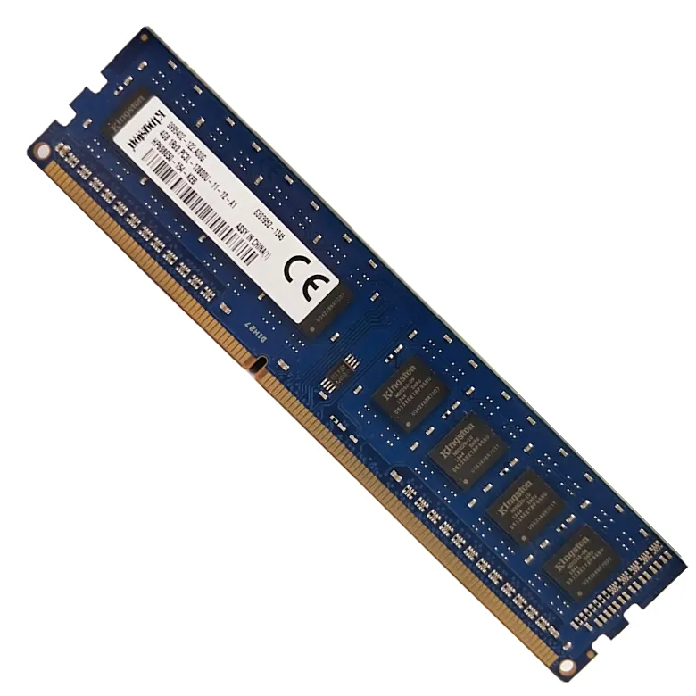

## 1.5 内存

> 内存（Memory），是大多数人最容易产生误区的计算机组件。许多人会把它与“储存空间”搞混淆，误以为他们的软件和资料都存在“内存“上。实际上人们口中说的”256G“”1TB“是“储存空间”，也就是硬盘大小，而内存是完全不同的概念。

### 1.5.1 内存是什么？先搞懂 “临时仓库” 的本质

咱们可以把计算机比作一家超市：

- **硬盘（机械硬盘 / 固态硬盘）** 是超市的 “仓库”，负责长期存放商品（文件、软件、系统），即使断电，里面的东西也不会消失；

- 而**内存（RAM，随机存取存储器）** 是超市的 “收银台工作台”—— 收银员要扫描商品（运行程序）时，会先把商品从仓库搬到工作台上，工作台越大，能同时处理的商品越多，结账速度就越快；一旦超市下班（电脑关机），工作台上没处理完的东西（临时数据）就会清空，下次开机需要重新从仓库调取。

简单说：**内存是计算机 “正在用” 的数据的临时存放地**。比如你同时打开微信、浏览器、Excel，这些程序的临时数据都在内存里运行；如果内存不够，工作台放不下，电脑就会 “卡顿”“未响应”，甚至自动关闭部分程序。

### 1.5.2 常见内存类型：别再分不清 DDR4 和 DDR5

现在市面上的消费级内存，主要是 “DDR 系列”，就像手机的 “5G” 和 “4G”，数字越大，技术越新、速度越快。目前主流的是 DDR4 和 DDR5，两者的区别可以总结为一张表：

| 类型 | 常见频率                  | 速度（理论） | 适用场景                    | 兼容性                                   |
| ---- | ------------------------- | ------------ | --------------------------- | ---------------------------------------- |
| DDR4 | 2400MHz、2666MHz、3200MHz | 最高 34GB/s  | 日常办公、中端游戏本        | 只支持 DDR4 主板，不能和 DDR5 混用       |
| DDR5 | 4800MHz、5600MHz、6400MHz | 最高 68GB/s  | 高端游戏、视频剪辑、3D 建模 | 只支持 DDR5 主板，速度比 DDR4 快一倍左右 |

举个例子：如果你的电脑是 2022 年之前买的中端本，大概率是 DDR4 内存；2023 年之后的新款高端本或台式机，基本以 DDR5 为主。**买内存时一定要先看主板支持哪种类型**，不然插不进去也用不了。

### 1.5.3 内存的关键参数：选多大、多快，看这 3 个指标

选内存不用看复杂参数，记住 3 个核心就行：

1. 容量：“工作台” 够不够大，看它！

这是最影响体验的参数，单位是 “GB”。不同使用场景，对容量的需求天差地别：

- **4GB**：只能满足最基础的需求，比如只开一个浏览器页面、写简单文档，多开一个程序就会卡顿，现在基本被淘汰；

- **8GB**：日常办公的 “入门标配”，能同时开微信、3-5 个浏览器标签、Excel，适合学生党和普通上班族；

- **16GB**：“主流黄金容量”，不管是玩《英雄联盟》《原神》等游戏，还是做轻度视频剪辑（1080P），都能轻松应对，大多数人选 16GB 不会错；

- **32GB 及以上**：适合 “重度需求”，比如专业视频剪辑（4K/8K）、3D 建模（Blender、3D Max）、运行虚拟机，普通用户没必要选这么大。

2. 频率：“工作台” 处理速度快不快，看它！

单位是 “MHz”，数值越高，内存读写数据的速度越快。比如 DDR4-3200 比 DDR4-2666 快，DDR5-5600 比 DDR5-4800 快。

但要注意：**频率不是 “越高越好”**。比如你的主板最高只支持 DDR4-3200，就算买了 DDR4-3600 的内存，也会自动降到 3200MHz 运行，白花冤枉钱。

3. 通道数：“单车道” 和 “双车道” 的区别

内存分 “单通道” 和 “双通道”，就像公路的车道：

- **单通道**：只有一条车道，数据只能 “单向排队” 传输，速度慢；

- **双通道**：两条车道，数据能 “双向同时传输”，速度比单通道快 30%-50%。

怎么实现双通道？买两条相同容量、相同频率的内存（比如两条 8GB DDR4-3200），插在主板上标有 “1+3” 或 “2+4” 的插槽里（插槽通常会用不同颜色区分）。比如你的电脑是 16GB 内存，“两条 8GB 双通道” 比 “一条 16GB 单通道” 体验好很多，尤其玩游戏时帧率更稳定。

### 1.5.4 怎么查自己的内存？不够用了怎么办？

1. 查内存信息：3 步搞定

不管是 Windows 还是 Mac，都能轻松查到内存参数：

- **Windows**：右键点击 “此电脑”→选择 “属性”，就能看到 “已安装内存（RAM）” 的容量；想查类型和频率，按下 “Win+R”，输入 “dxdiag”，在 “内存” 选项里能看到 “类型”（比如 DDR4）和 “频率”；

- **Mac**：点击屏幕左上角苹果图标→选择 “关于本机”，在 “内存” 里能看到容量、类型和通道数（比如 “16GB DDR5 统一内存”）。

2. 内存不够用了：两种解决办法

如果你的电脑经常卡顿，打开任务管理器（Windows 按 “Ctrl+Shift+Esc”，Mac 按 “Command+Option+Esc”）发现内存占用率经常超过 90%，就该升级了：

- **台式机**：直接买一条和原有内存 “同类型、同频率” 的内存插上（比如原有是 8GB DDR4-3200，就再买一条 8GB DDR4-3200），组成双通道；

- **笔记本**：部分笔记本内存是 “板载” 的（直接焊在主板上，不能拆），只能通过 “加一条插槽内存” 升级；如果是 “可插拔” 内存，直接换更大容量的即可（比如把两条 4GB 换成两条 8GB）。

- **通用（虚拟内存）**：作为物理内存的 “临时替代方案”，可通过划分硬盘空间模拟内存缓解不足问题，相当于给电脑加了个 “备胎仓库”。

  - **Windows 系统**：右键 “此电脑”→“属性”→“高级系统设置”→“性能 - 设置”→“高级”→“虚拟内存 - 更改”，取消 “自动管理” 后选空闲分区设自定义大小，通常初始值为物理内存的 1-1.5 倍，最大值为 2-3 倍（如 8GB 内存可设初始 8192MB、最大 24576MB），设置后重启生效。

  - **macOS 系统**：默认自动管理虚拟内存，若需手动调整，可通过终端修改`/etc/sysctl.conf`文件参数，先停止交换文件服务，再创建新交换文件后重新加载服务（操作前建议备份数据）。

    *注意*：虚拟内存依赖硬盘读写，速度远慢于物理内存，并且由于硬盘具有一定的读写次数上限，分配过多的虚拟内存可能导致硬盘受损。这么做的前提是保证硬盘有足够空闲空间，另外SSD 相比 HDD 能提升虚拟内存响应速度；然而不建议完全关闭虚拟内存，否则可能导致系统崩溃或软件报错。

*提醒*：升级前最好查一下电脑型号的 “硬件规格”，确认内存是否支持扩展、最大支持多大容量，避免买错。

### 1.5.5 常见误区

1. **“内存越大，电脑越流畅”？** 不一定。如果你的电脑是老旧机型（比如 CPU 是 i3-7 代、显卡是入门级），只升级内存，流畅度提升有限；

2. **“内存和硬盘一样，能长期存东西”？** 内存是 “临时存储”，电脑关机后数据就没了，所以编辑文档时一定要及时保存，避免断电丢失；

3. **“不同品牌的内存不能一起用”？** 可以但不建议。只要类型、频率、容量相同，大多数品牌可以混用（比如金士顿和芝奇的 DDR4-3200 8GB），但尽量选同品牌，稳定性更好。