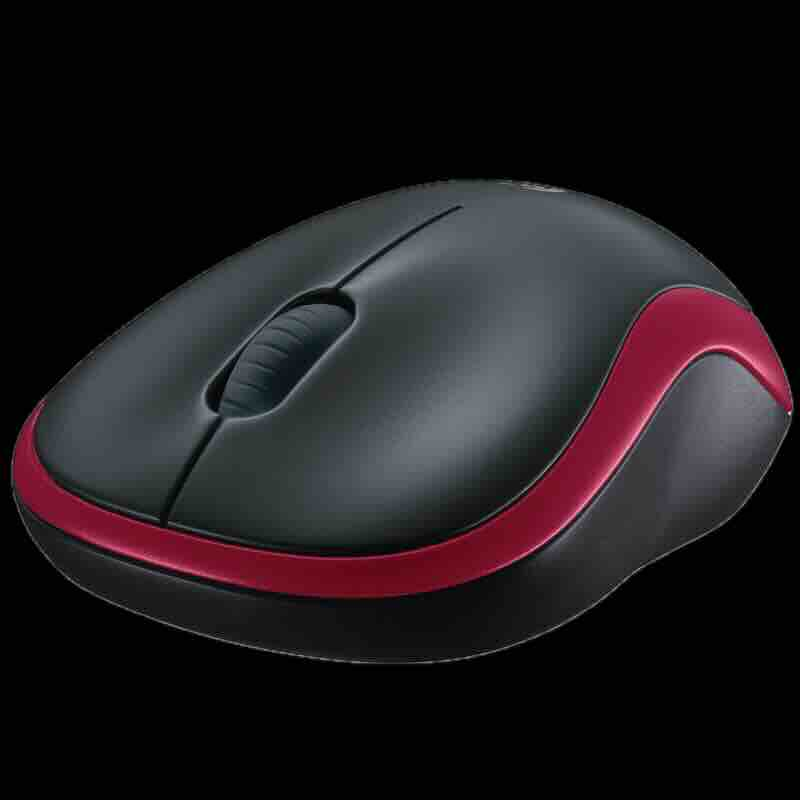

## 1.8 鼠标

### 1.8.1 鼠标的作用

鼠标是计算机的一种外接输入设备，也是计算机显示系统纵横坐标定位的指示器。

它的名字来源于其外形，因拖着一条长长的数据线，形似老鼠而得名。

鼠标的核心作用是简化电脑操作，通过移动光标和点击按键，代替键盘繁琐的指令，实现对图形化界面（如 Windows、macOS）的直观操作。

### 1.8.2 鼠标的分类

根据工作原理和内部构造，鼠标主要分为以下三类：机械鼠标、光电鼠标和激光鼠标。

- 机械鼠标

特征：底部有一个可以四向滚动的小胶球 。
原理：移动鼠标时，小球带动内部的转轴（X轴和Y轴）转动，转轴上的译码轮通过金属导电片与电刷接触，产生“通/断”的脉冲信号，从而计算出位移。
现状：由于容易藏污纳垢、定位精度低且磨损严重，已基本被淘汰。

- 光电鼠标

特征：底部有发光二极管（通常是红色LED）和小型摄像头，没有滚球。
原理：通过LED照亮鼠标垫表面，内置的图像传感器（IAS）以极快速度连续拍摄桌面图像，数字信号处理器（DSP）通过对比这些图像之间的特征点变化来确定移动的方向和距离。
优势：定位准确，灵敏度高，没有机械磨损，几乎无需维护。

- 激光鼠标

特征：属于光电鼠标的升级版，使用激光作为光源，通常是不可见光 。
原理：激光具有更好的相干性，能更清晰地感知表面细节。
优势：分辨率极高，可以在玻璃、高光亮面等几乎任何表面上正常工作 。

除了上述分类，根据连接方式可分为有线鼠标（USB接口、PS/2接口）和无线鼠标。无线鼠标又分为2.4GHz（需接收器，延迟低）和蓝牙（无需占用USB口，连接方便）两种。

### 1.8.3 鼠标的核心性能指标

选购或使用鼠标时，了解以下几个指标至关重要：

- DPI（每英寸点数）/CPI（每英寸采样次数）

定义：鼠标每移动一英寸，光标在屏幕上移动的像素点数。DPI越高，鼠标移动相同物理距离，光标划过屏幕的距离越长 。
意义：高DPI适合高分辨率的大屏幕显示器，能让光标轻松划过整个屏幕。游戏玩家通常需要高DPI来快速转身，但同时也需要低DPI进行精细瞄准，因此许多游戏鼠标支持DPI一键切换 。

- 回报率 / 轮询率

定义：鼠标向电脑报告其位置信息的频率，单位是Hz 。
意义：1000Hz的回报率意味着每1毫秒报告一次，理论上延迟更低，移动更平滑。高回报率对竞技类游戏（如FPS射击游戏）非常关键，但也会略微增加电脑CPU的负担 。

- IPS（每秒可移动英寸数）

定义：鼠标能够准确追踪的最大移动速度 。
意义：当玩家快速甩动鼠标时，如果移动速度超过IPS上限，传感器会“懵掉”，导致光标乱飞（即丢帧）。高端游戏鼠标的IPS可达400甚至650以上 。

- LOD（静默距离/响应高度）

定义：鼠标从桌面抬起后，光标完全失去响应的高度 。
意义：对于需要频繁抬起鼠标调整位置的玩家，LOD越低越好，这样可以避免在移动鼠标过程中光标晃动 。

### 1.8.4 鼠标的日常使用与维护

为了保持鼠标的良好性能和延长其使用寿命，日常维护不可忽视.

- 保持清洁

表面与缝隙：定期用柔软的湿布擦拭外壳。按键缝隙可用牙签包裹棉花或压缩空气清理。

底部与传感器：用干布清洁脚垫。如果传感器（光学孔）有灰尘，用干棉签轻轻擦拭镜头。

- 正确使用

避免暴力：不要用力敲击按键或猛力拉扯线缆。拔插头时应握住USB接口端，而非直接拉扯线缆。

配合鼠标垫：即使是高性能鼠标，搭配一款合适的鼠标垫不仅能提高定位精度，也能减少底部脚垫的磨损。

善待线材：对于有线鼠标，收纳时应避免线缆过度缠绕、打结或被重物挤压，以防内部导线断裂。

### 1.8.5 鼠标的选购建议

在选购鼠标时，不应只追求高参数，而应结合自身需求。

- 明确用途

办公/家用：注重舒适度（人体工学）、静音效果、无线便携性，DPI在1000-1600左右即可 。

游戏玩家：注重高性能传感器（高DPI、高IPS、高回报率）、按键手感（微动开关寿命）、可编程按键以及稳定的连接（有线或高性能2.4G无线）。

设计/专业软件：需要高精度的激光鼠标，并最好带有可自定义的侧键，以便在专业软件中提高效率 。

- 关注手感

大小与握姿：选择与手掌大小相匹配的鼠标。趴握适合饱满的鼠标，抓握或指握适合中小型鼠标。最好能线下体验或选择支持无理由退换的电商购买 。

注意售后与品牌：知名品牌（如罗技、雷蛇、双飞燕等）通常在质保、驱动软件支持方面更有保障。注意查看保修期限（如一年包换、三年保修等）。

>[!CAUTION]
> 本教程不构成对特定品牌的购买建议。
